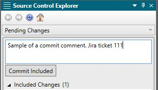

<?xml version="1.0" encoding="utf-8"?>
<html xmlns:MadCap="http://www.madcapsoftware.com/Schemas/MadCap.xsd">
    <head>
    </head>
    <body>
        <h1>Commit your files to GitHub</h1>
        
Before your push your project to GitHub, you will need to commit your files.

        
1. Depending on the MadCap interface you are using, start the process by doing one of the following:

        <ul>
            <li>
                
In the lower-right of Flare, select the <b>Source Control Explorer Pending Changes</b> icon. 

            </li>
            <li>
                
From the <b>Source Control</b> ribbon, open the <b>Pending Changes window pane</b>. Select the appropriate files in the window pane, then select <b>Commit</b>.

            </li>
            <li>
                
Select <b>Source Control</b> in the ribbon at the top of the screen, then select 

                <ul>
                    <li>
                        
<b>Commit</b> to commit selected files. 

                    </li>
                    <li>
                        
<b>Source Control</b>, then click <b>Commit All</b> to commit all files in the project.

                    </li>
                </ul>
            </li>
            <li>
                
Right-click in any window pane, right-click the file to be committed. Select <b>Source Control</b>, then select:

                <ul>
                    <li>
                        
<b>Commit</b> to commit selected files. 

                    </li>
                    <li>
                        
<b>Source Control</b>, then click <b>Commit All</b> to commit all files in the project.

                    </li>
                </ul>
            </li>
        </ul>
        
2. Provide a comment. Doing so provides an audit trail for the update. This comment can be viewed from the History dialog.

        

            
        

        
3. Select <b>Commit Included</b>.

    </body>
</html>
