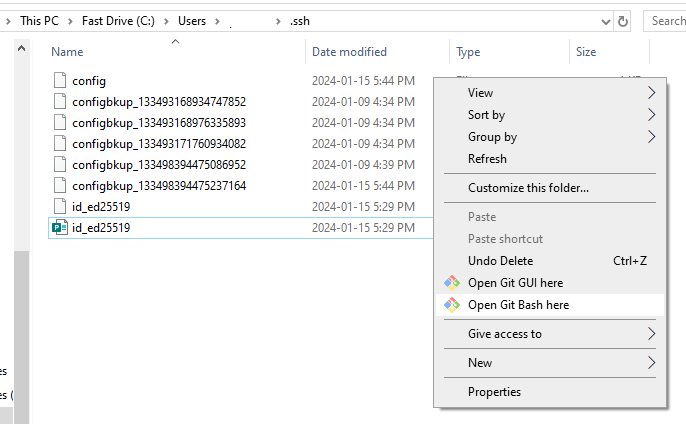

<?xml version="1.0" encoding="utf-8"?>
<html xmlns:MadCap="http://www.madcapsoftware.com/Schemas/MadCap.xsd">
    <head>
    </head>
    <body>
        <h1>Access private and public SSH key pairs</h1>
        
To connect your GitHub repository to MadCap Flare, you will need to access and copy the private/public key pair located on your local drive. 

        
If you do not have a private/public key pair, you can generate one following the steps in the <a href="Generate-key-pairs.htm">Generate a private and public key pair tutorial</a>. 

        <h2>&#160;</h2>
        <h2>Copying keys </h2>
        
If you followed the steps in the <a href="Generate-key-pairs.htm">Generate a private and public key pair tutorial</a>, your keys will be located in the <code>.ssh</code> folder under <code>C:\Users\[username]\</code>.

        
 The keys will be listed as files with names similar to: <code>id_dsa</code> or <code>id_ed25519</code> (this will be your private key), as well as a matching file with a <code>.pub</code> extension (this is the public key). 

        <h2>&#160;</h2>
        <h2>Accessing with Notepad</h2>
        <ol>
            <li>
                
You can access your public keys by right-clicking the file and selecting <b>Open with</b>

            </li>
            <li>
                
Select theNotepadapp, then select OK.

            </li>
            <li>
                
The public key file will open in Notepad as plain text. You can now select the text and copy it.
                

            </li>
        </ol>
        <h2>&#160;</h2>
        <h2>Accessing with Git Bash</h2>
        
You cannot open access the private key with Notepad. The easiest way to copy your private key is to use Git Bash. 

        <ol>
            <li>
                
Navigate to the<code>.ssh</code> file

            </li>
            <li>
                
Right-click anywhere in the folder (not on a file) and select <b>Open Git Bash here</b>.

                

                    
                

            </li>
            <li>
                
The Git Bash command app will open. Copy <code>cat ~/.ssh/File.Name.pub</code>where <code>File.Name</code> is the name of the SSH key file, then hit <b>Enter</b>. 

            </li>
            <li>
                
The private key will be shown and is copied to your clipboard.

            </li>
        </ol>
        
&#160;

    </body>
</html>
