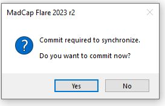

<?xml version="1.0" encoding="utf-8"?>
<html xmlns:MadCap="http://www.madcapsoftware.com/Schemas/MadCap.xsd">
    <head>
    </head>
    <body>
        <h1>Push files to  your GitHub repository</h1>
        <ol>
            <li>
                
Once you have MadCap Flare connected to your GitHub repository, you are now ready to push your MadCap project to GitHub.

                
<b>NOTE</b>:&#160;you should <a href="commit-to-github.htm">commit all files</a> before pushing. 

            </li>
            <li>
                
Depending on the MadCap interface you are using, start the process by doing one of the following:

                <ul>
                    <li>
                        
Select the <b>Synchronize icon</b>. 

                    </li>
                    <li>
                        
Select <b>Source Control</b>, then <b>Push</b>.

                    </li>
                    <li>
                        
Right-click on any file, select <b>Source Control</b>, then <b>Project</b>, then click <b>Push</b>.

                        
<b>NOTE</b>: If you didn't commit your files before starting the push, you will be prompted to commit your files. Select <b>Yes</b> to continue. 

                        

                            
                        

                    </li>
                </ul>
            </li>
            <li>
                
The <b>Select Remote for Push dialog box</b> will appear. Click the <b>Remote drop-down</b> and select the appropriate repository.

                

                    
                

                
<b>NOTE</b>: You can add or remove a repository from this dialog window by selecting the <b>ellipse menu</b>. 

            </li>
            <li>
                
Select <b>OK</b>. 

            </li>
            <li>
                
You may be prompted to sign-in using your user name and password, then select <b>OK</b>. 

            </li>
            <li>
                
Navigate to your GitHub repository and refresh to see the changes. 

            </li>
        </ol>
        
&#160;

        
&#160;

        
&#160;

        
&#160;

    </body>
</html>
